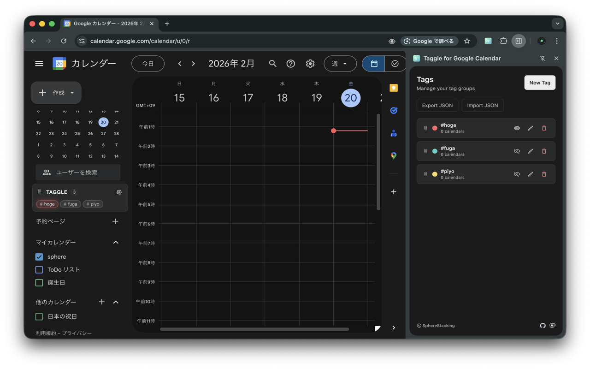

<p align="center">
  
</p>

<h1 align="center">Taggle for Google Calendar</h1>

<p align="center">Google Calendarのカレンダーにタグを付けて、タグ単位で表示/非表示を切り替えるChrome拡張です。</p>

<p align="center">
  
</p>

## 主な機能

- カレンダー一覧の取得
- タグ作成（色付き）
- 1つのカレンダーに複数タグを付与可能（多対多）
- タグ単位で反転トグル
- ローカル保存（`chrome.storage.local`）

## 開発

```bash
pnpm install
pnpm dev
```

## ビルド

```bash
pnpm build
```

## Chromeでの読み込み（初回のみ）

1. `pnpm build`
2. [chrome://extensions/](chrome://extensions/) を開く
3. デベロッパーモードを有効化
4. 「パッケージ化されていない拡張機能を読み込む」→ `dist`

## 2回目以降（開発時）

- `pnpm dev` で起動
- `chrome://extensions/` の「更新」ボタンで反映
